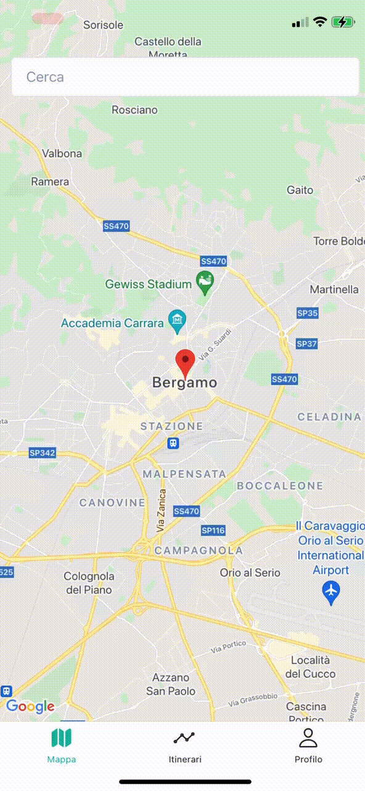

# Team Hackatomici - Download Innovation Hackaton 2021

> Progetto sviluppato in 48h - Download Hackathon 2021

## 💡 Idea

Abbiamo creato un'app mobile (Android/IOS) che permette di consultare le normative vigenti sull'emergenza sanitaria. Con questa applicazione l'utente ha la possibilità di creare e organizzare viaggi/spostamenti di qualsiasi natura, monitorando da un'unica interfaccia le normative vigenti sui territori interessati da questo itinerario. Si prenderà visione sia delle regole dettate da enti pubblici sia segnalazioni da parte della community, votabili per confermarne la veridicità.

Le funzionalità sono le seguenti:

- Possibilità di registrarsi tramite Google:

- Possibilità di registrarsi tramite email e password:

- Possibilità di impostare dei luoghi preferiti in modo da ricevere una notifica in caso di inserimento di una nuova normativa.

- Possibilità di inserire un itinerario per rimanere aggiornati sulle normative in vigore durante il viaggio.

- Possibilità di cercare per ogni singolo luogo le normative vigenti.

- Possibilità di aggiungere una nuova segnalazione per informare la community.

- Possibilità di votare le segnalazioni inserite dalla community.

- Possibilità di ricevere aggiornamenti riguardo i propri itinerari e luoghi preferiti (notifiche push).

---
## 🏗️ Infrastruttura

Il progetto è composto da due parti, un'app mobile (Android e iOS) scritta in [React Native](https://reactnative.dev/) ed un backend PHP basato sul framework [Lumen](https://lumen.laravel.com/). 

Abbiamo utilizzato [Firebase](https://firebase.google.com/) per gestire il login (tramite email/password oppure tramite Google) e le notifiche push.

Abbiamo utilizato [Native Base](https://nativebase.io/) come libreria per stilare i componenti uniformemente e [Redux](https://redux.js.org/) per gestire lo stato interno dell'app. 

Abbiamo utillizato [Google Places API](https://developers.google.com/maps/documentation/places/web-service/overview) per la geolocalizzazione dei posti, usando il <b>place_id</b> di ogni singolo luogo come punto di riferimento. Inoltre abbiamo cacheato nel nostro database le varie chiamate che vengono effettuate a Google in modo da essere più veloci nella riposta e per risparmiare chiamate.

Abbiamo aggiunto una action su Github che ad ogni push su main deploya tutto il backend su [Heroku](https://dashboard.heroku.com/). Prima buildando l'immagine docker del backend e poi caricandola in cloud. Come database utilizziamo [RDS](https://aws.amazon.com/it/rds/) di AWS.

---
## Local setup

### Backend

#### Requirements
- [Docker](https://www.docker.com/);
- Un token Google, per utilizzare le Places API;
- Una account di servizio di Firebase, per l'autenticazione e l'invio delle notifiche;

#### Installation
- `cd` in _/backend_
- Creare il `.env` con `cp .env.example .env` e compilarlo con tutte le variabili d'ambiente necessarie
- Incollare il file dell'account di servizio di Firebase `hackatomici-2021-firebase.json` in _/backend_
- Avviare i container con `docker-compose up -d`
- Il backend è raggiungibile all'indirizzo _localhost:80_

### Mobile app
> <b>NB</b>: Tutte le istruzioni nel file README.md sono relative a macOS. Per riprodurre questo tutorial su un sistema operativo differente, è necessario cercare i package di dipendenza e la relativa installazione.

#### Requirements

Per poter eseguire il progetto, è necessario installare `node` e `watchman`.

    brew install node
    brew install watchman

Un'altra dipendenza è Xcode. È possibile scaricarlo da [Apple](https://developer.apple.com/xcode/downloads/).

L'ultima dipendenza è CocoaPods. È possibile installarlo con:

    sudo gem install cocoapods

Una volta installate le dipendenze, entrare nella cartella del progetto e scaricare i node_modules con:

    // using npm
    npm install
    // using yarn
    yarn

##### Android

Per lanciare l'app su Android è sufficiente eseguire il comando:

    // using npm
    npx react-native run-android
    // using yarn
    yarn android

##### iOS

Prima di lanciare l'app su iOS bisogna assicurarsi di aver installato CocoaPods.
Con CocoaPods installato, lanciare il seguente comando per scaricare i Pods necessari:

    cd ios && pod install && cd ..

Per lanciare l'app su iOS eseguire il comando:

    // using npm
    npx react-native run-ios
    // using yarn
    yarn ios

---

## 👨‍💻 Autori
- ### [Giorgio Berolotti](https://bertolotti.dev/)
- ### [Domenico Gaeni](https://domenicogaeni.dev/)
- ### Stefano Zanini
- ### Lorenzo Milesi

